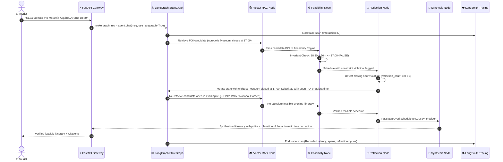
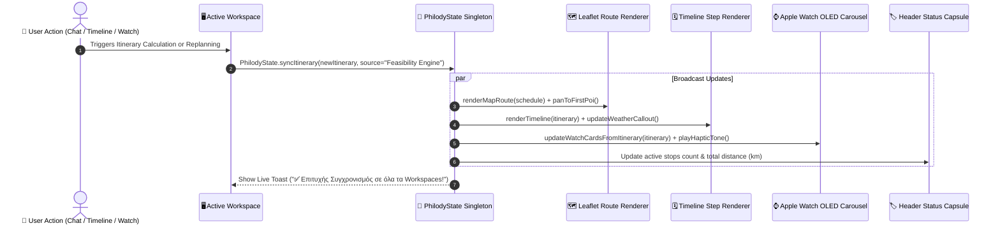
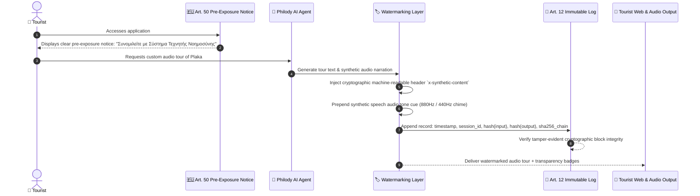

# 🏛️ Philody AI Travel Assistant — Architecture & Data Flow Specification
## Η συνάντηση της αρχαιοελληνικής κληρονομιάς & φιλίας («Φίλος» + «Ωδή»), της τεχνολογικής καινοτομίας (Generative AI & Smart City IoT) και της μαθηματικής ακρίβειας (Deterministic Feasibility Engine)
*v2.0 | Production Ready | 260 lines*

This document provides a comprehensive technical overview and visual architectural blueprints for the **Philody AI Travel Assistant**. The architecture enforces a strict separation of concerns between probabilistic LLM generation (NVIDIA Nemotron-3-Ultra via Ollama Cloud), grounding knowledge retrieval (RAG), live IoT/weather/transit integration (DOTSOFT, OpenWeather, Athens Metro), deterministic feasibility validation (Feasibility Engine), enterprise safety (**Parallel Dual-Layer Guardrails**), autonomous self-correction (**LangGraph State Graph with Reflection Loops**), and regulatory compliance (**EU AI Act Articles 50 & 12**).

---

## 📊 1. Master System Architecture Diagram

```mermaid
graph TD
    %% User & Client Layer
    subgraph Client_Layer [Client & Edge Layer (index.html)]
        LandingUI[🏛️ 0. Architectural Showcase 360°]
        ChatMapUI[🗺️ 1. Chat & Dynamic Leaflet Map]
        TimelineUI[🗓️ 2. Feasibility Timeline Studio]
        WatchUI[⌚ 3. Apple Watch Ultra OLED Simulator]
        IoTHubUI[🎛️ 4. DOTSOFT Smart City IoT Hub]
        EvalUI[📊 5. Evaluation & Guardrails Studio]
        PhilodyStateMgr[(🔄 PhilodyState Central JS Store)]
    end

    %% Edge & Network Ingestion
    subgraph Edge_Gateway [Edge & Smart City Network Layer]
        DOTSOFT_GW[DOTSOFT 5G NB-IoT Gateway<br/>Crowd Counters, Microclimate, BLE Proximity]
        Wearable_BLE[Wearable Edge Pulse / ECG / Haptic Node<br/>PPG Optical Pulse, Taptic Engine]
        PublicTransitAPI[Athens Public Transit Mock API<br/>Metro M1/M2/M3, Tram, Live Schedules]
    end

    %% Enterprise REST API Gateway
    subgraph Gateway_Layer [Enterprise REST API Layer (api.py)]
        FastAPI[FastAPI Gateway (Uvicorn Async Engine)<br/>/api/v1/chat | /api/v1/chat/graph<br/>/api/v1/itinerary/generate | /api/v1/weather<br/>/api/v1/iot/event | /api/v1/health<br/>/api/v1/observability/status | /api/v1/metrics]
        Prometheus[📈 Prometheus & Grafana Observability<br/>HTTP 5xx, Latency p99, CPU/GPU, RAG QPS]
    end

    %% Dual-Layer Guardrails & Safety
    subgraph Guardrails_Layer [🛡️ Parallel Guardrails & Security Layer]
        Input_Guard[InputGuardrail<br/>- Anti-Injection Defense (jailbreak, system prompt override)<br/>- Domain Boundary Filter (rejects non-travel / dangerous)]
        Output_Guard[OutputGuardrail<br/>- Deterministic Fact-Checking & Closed POI Interceptor<br/>- Private Phone / Fake Contact Sanitizer<br/>- Citation Grounding Verifier]
        ParallelExec[⚡ Parallel Guardrail Evaluator<br/>Concurrent Input/Output Inspection]
    end

    %% Orchestrator & State Management
    subgraph Orchestration_Layer [LLM Orchestrator & LangGraph Engine]
        Router[Strict Pydantic Intent Classifier<br/>factual_qa | itinerary_request | replanning | weather_query]
        State[Explicit UserState Manager (Sessions / In-Memory Cache)<br/>Time Budget, Kid Friendly, Wheelchair, Blacklist, Active Plan]
        LangGraph[LangGraph State Graph<br/>TouristAgentState -> Guardrail -> Retrieval -> Feasibility -> Reflection Loop]
        ReflectionNode{🔄 Reflection Engine<br/>Validates Closing Hours & Rain}
        FallbackChains[🛠️ Fallback Chains & JSON Repair Loop<br/>Pydantic Tool Arguments + 4-Tier Fallback]
    end

    %% Observability Layer
    subgraph Observability_Layer [👁️ LLM Observability & Tracing Hub]
        LangSmith[LangSmith / Distributed Tracing Hub<br/>@trace_rag_chain | @trace_tool_call | @trace_graph_node]
        AuditLog[(📜 EU AI Act Art. 12 Immutable Log<br/>Append-only SHA-256 Hash Chain)]
    end

    %% Knowledge & RAG Layer
    subgraph Knowledge_Layer [Grounding & Knowledge Base]
        UnifiedPipeline[Unified Batch & Streaming Embedding Pipeline<br/>Dynamic Contextual Chunking & Summary Decoupling]
        VectorDB[(In-Memory Vector DB / Cosine Dense Retriever)<br/>data/athens_attractions.json (16 Curated Athens POIs)]
    end

    %% Tools & Telemetry Layer
    subgraph Tools_Layer [Live Tools & External APIs]
        WeatherAPI[tools/weather.py<br/>OpenWeatherMap Client + Resilient Local Mock]
        IoT_Tools[tools/iot.py & tools/wearable.py<br/>Crowd Queue Penalties & Biometric Spikes]
        Transit_Tools[Public Transit & Live Ticketing Engine<br/>Walking, Metro, Bus, Waiting Times]
    end

    %% Deterministic Rules Engine
    subgraph Engine_Layer [Deterministic Rules Engine]
        Feasibility[engine/feasibility.py<br/>- Haversine Geodesic Distance Matrix<br/>- Hard Closing Hours Invariant: t_arr + t_dur <= t_close<br/>- Walking Buffer: v_walk = 4.0 km/h + 5 min buffer<br/>- Accessibility & Weather Hard Filters]
    end

    %% Regulatory Compliance Layer
    subgraph Compliance_Layer [⚖️ EU AI Act Article 50 & 12 Layer]
        Art50_Notice[Mandatory Pre-Exposure Transparency Notice<br/>Chatbot & Synthetic Content Disclosures]
        Art50_Watermark[Machine-Readable Cryptographic Watermarking<br/>Synthetic Text Markers & Audio Tour Watermarks]
    end

    %% Presentation Layer
    subgraph Presentation_Layer [Presentation & Synthesis]
        LLM_Synth[NVIDIA Nemotron-3-Ultra / Local Deterministic Synthesizer<br/>Structured Markdown + Clickable Citations]
    end

    %% Execution Connections
    ChatMapUI -->|User Message| FastAPI
    TimelineUI -->|Feasibility Parameters| FastAPI
    WatchUI -->|Biometric Alert| FastAPI
    IoTHubUI -->|Sensor Event| FastAPI
    EvalUI -->|Run Audit| FastAPI
    PhilodyStateMgr <-->|Cross-Tab State Sync| ChatMapUI
    PhilodyStateMgr <-->|Cross-Tab State Sync| TimelineUI
    PhilodyStateMgr <-->|Cross-Tab State Sync| WatchUI
    
    FastAPI -->|Inspect Request| ParallelExec
    ParallelExec --> Input_Guard
    ParallelExec --> Output_Guard
    Input_Guard --> Router
    FastAPI --> Prometheus

    Router --> LangGraph
    LangGraph --> State
    LangGraph --> UnifiedPipeline
    UnifiedPipeline --> VectorDB

    LangGraph --> WeatherAPI
    LangGraph --> Transit_Tools
    DOTSOFT_GW -.-> IoT_Tools
    Wearable_BLE -.-> IoT_Tools
    PublicTransitAPI -.-> Transit_Tools

    VectorDB --> Feasibility
    WeatherAPI --> Feasibility
    IoT_Tools --> Feasibility
    Transit_Tools --> Feasibility

    Feasibility --> ReflectionNode
    ReflectionNode -->|❌ Violation Detected / Replanning| UnifiedPipeline
    ReflectionNode -->|✅ Feasible Itinerary| LLM_Synth

    LangGraph -.-> LangSmith
    FastAPI -.-> AuditLog

    LLM_Synth --> Art50_Watermark
    Art50_Watermark --> Art50_Notice
    Art50_Notice --> FastAPI

    FastAPI -->|Response + Citations + Watermark| ChatMapUI
    FastAPI -->|Synced Itinerary JSON| PhilodyStateMgr
```

---

## 🔁 2. End-to-End Data Flow Sequences

### Sequence 1: LangGraph Autonomous Reflection & Self-Correction Loop


### Sequence 2: Central State Synchronization (`PhilodyState`) Across 6 Workspaces


### Sequence 3: EU AI Act Articles 50 & 12 Compliance Pipeline


---

## 🧩 3. Architectural Component Deep Dive

| Component | Technology | File Path | Architectural Responsibility |
| :--- | :--- | :--- | :--- |
| **Enterprise API Gateway** | FastAPI, Uvicorn, Pydantic v2 | [`api.py`](file:///c:/Users/wwefi/OneDrive/Υπολογιστής/AI%20Tourist%20Assistant/api.py) | High-performance asynchronous REST API, CORS handling, static assets, health checks, and OpenAPI 3.0 documentation. |
| **LangGraph State Graph** | LangGraph, Python StateGraph | [`orchestrator/graph.py`](file:///c:/Users/wwefi/OneDrive/Υπολογιστής/AI%20Tourist%20Assistant/orchestrator/graph.py) | Cyclic state transitions, reflection nodes, autonomous replanning loops, and resilient state mutation. |
| **LLM Observability & Tracing** | LangSmith SDK, In-Memory Buffer | [`orchestrator/observability.py`](file:///c:/Users/wwefi/OneDrive/Υπολογιστής/AI%20Tourist%20Assistant/orchestrator/observability.py) | Distributed trace collection, latency tracking, span attribution, error inspection, and telemetry endpoints. |
| **Parallel Guardrails Engine** | Asyncio / ThreadPool, Regex & Pydantic | [`orchestrator/guardrails.py`](file:///c:/Users/wwefi/OneDrive/Υπολογιστής/AI%20Tourist%20Assistant/orchestrator/guardrails.py) | Concurrent input prompt injection inspection and output fact-checking/citation validation. |
| **Context Length Manager** | Tokenizers, Sliding Window Truncation | [`orchestrator/context_manager.py`](file:///c:/Users/wwefi/OneDrive/Υπολογιστής/AI%20Tourist%20Assistant/orchestrator/context_manager.py) | Token cost calculator, system reserve budgeting, delimiting tokens (`[BOS]`, `[EOS]`, `<|endoftext|>`), overflow prevention. |
| **Unified Embedding Pipeline** | Dense Vectorizer, Cosine Similarity | [`rag/pipeline.py`](file:///c:/Users/wwefi/OneDrive/Υπολογιστής/AI%20Tourist%20Assistant/rag/pipeline.py) | Dynamic contextual chunking, summary decoupling, unified batch & streaming vector indexing. |
| **EU AI Act Compliance** | Cryptographic Watermarking, SHA-256 | [`orchestrator/audit_logger.py`](file:///c:/Users/wwefi/OneDrive/Υπολογιστής/AI%20Tourist%20Assistant/orchestrator/audit_logger.py) & [`tools/watermarking.py`](file:///c:/Users/wwefi/OneDrive/Υπολογιστής/AI%20Tourist%20Assistant/tools/watermarking.py) | Pre-exposure transparency notices (Art. 50), synthetic content watermarking, immutable append-only audit trail (Art. 12). |
| **Operational Metrics Hub** | Prometheus client, Custom Collectors | [`monitoring/observability.py`](file:///c:/Users/wwefi/OneDrive/Υπολογιστής/AI%20Tourist%20Assistant/monitoring/observability.py) | HTTP 5xx tracking, p99 latency histograms, CPU/GPU utilization monitors, RAG query rates. |
| **Deterministic Feasibility Engine** | NumPy, Geodesic Mathematics | [`engine/feasibility.py`](file:///c:/Users/wwefi/OneDrive/Υπολογιστής/AI%20Tourist%20Assistant/engine/feasibility.py) | Haversine distance matrix computation, walking travel times ($v_{\text{walk}} = 4.0\text{ km/h} + 5\text{m buffer}$), opening hours invariants. |
| **Smart City IoT & Wearables** | Web Audio API, Haptics, NB-IoT REST | [`tools/wearable.py`](file:///c:/Users/wwefi/OneDrive/Υπολογιστής/AI%20Tourist%20Assistant/tools/wearable.py) & [`index.html`](file:///c:/Users/wwefi/OneDrive/Υπολογιστής/AI%20Tourist%20Assistant/index.html) | Physical Apple Watch Ultra simulation, Crown dial rotation, live ECG, fatigue alerts, and crowd sensors. |
| **Consolidated Test Suite** | Pytest, Mocking, Test Runners | [`tests/run_all_tests.py`](file:///c:/Users/wwefi/OneDrive/Υπολογιστής/AI%20Tourist%20Assistant/tests/run_all_tests.py) | 9 unified test suites covering all system layers with 100% pass rate. |

---

## 📐 4. Mathematical Constraint Formulations

The Feasibility Engine enforces four mathematical invariants on every suggested plan:

1. **Temporal Opening Hours Invariant**:
   $$\forall \text{poi}_i \in \text{schedule}: \quad t_{\text{arrival}}(i) + t_{\text{duration}}(i) \le t_{\text{closing}}(\text{poi}_i)$$
   *If the departure time exceeds closing hours, the attraction is rejected or automatically rescheduled by the reflection node.*

2. **Geodesic Haversine Distance Formula**:
   $$a = \sin^2\left(\frac{\Delta \phi}{2}\right) + \cos(\phi_1)\cos(\phi_2)\sin^2\left(\frac{\Delta \lambda}{2}\right)$$
   $$d = 2 R \cdot \text{atan2}\left(\sqrt{a}, \sqrt{1 - a}\right)$$
   *Calculates pedestrian distance between coordinates with Earth radius $R = 6,371\text{ km}$.*

3. **Pedestrian Walking Transit Time with Delay Buffer**:
   $$t_{\text{transit}}(i, i+1) = \left\lceil \frac{d(i, i+1)}{v_{\text{walk}}} \times 60 \right\rceil + t_{\text{buffer}}$$
   *Where $v_{\text{walk}} = 4.0\text{ km/h}$ and $t_{\text{buffer}} = 5\text{ minutes}$.*

4. **Total Time Budget Constraint**:
   $$\sum_{i=1}^{N} t_{\text{duration}}(i) + \sum_{i=1}^{N-1} t_{\text{transit}}(i, i+1) \le T_{\text{budget}}$$

---

## 📋 Document Map & Cross-References

| Document | Purpose |
|---|---|
| [`README.md`](README.md) | Installation, operational manual, evaluation scorecard, deliverables index |
| [`TECHNICAL_DESIGN_NOTE.md`](TECHNICAL_DESIGN_NOTE.md) | In-depth architectural design, RAG strategy, guardrails, production scaling |
| [`LEADERSHIP_COACHING_PLAN.md`](LEADERSHIP_COACHING_PLAN.md) | Team leadership, coaching, blameless postmortem, career development |
| [`USER_GUIDE.md`](USER_GUIDE.md) | End-user platform guide, troubleshooting, REST API reference |
| [`ASSIGNMENT_COVERAGE.md`](ASSIGNMENT_COVERAGE.md) | 19/19 requirements traceability audit — full KPI→implementation map |

<div align="center">
  <b>Philody AI Travel Assistant &bull; Architectural Specification v2.0</b><br>
  <i>DOTSOFT Smart City Integration &bull; Grounded RAG &bull; LangGraph Autonomous Reflection &bull; EU AI Act Compliance</i><br>
  <b>19/19 Assignment Requirements ✅ &bull; Production Ready</b>
</div>
